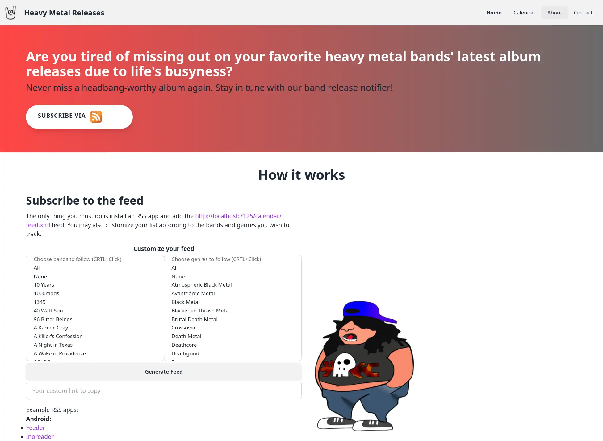
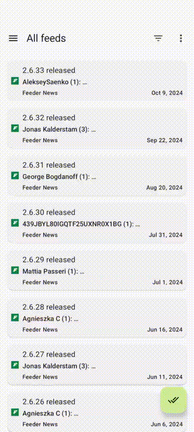
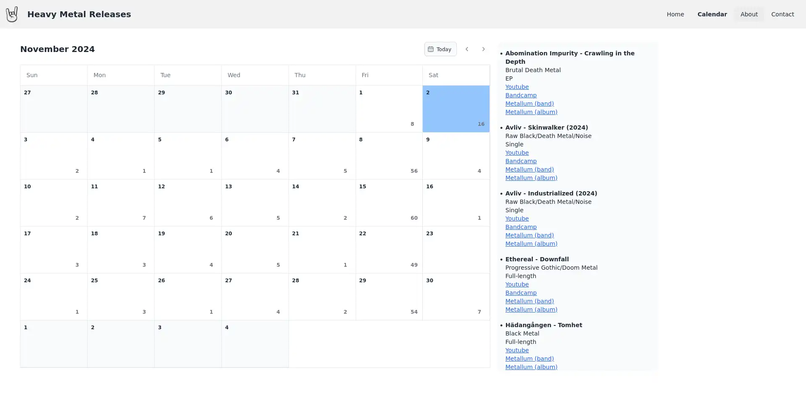

<div align="center">

# Heavy Metal Notifier
**The only system you need to stay in the loop \m/**

<br>



</div>

Do you often miss out on the latest heavy metal album releases from your favorite bands due to a busy schedule? If so, we have the perfect solution for you! Our project will notify you via RSS time whenever there are new releases. The application works by creating a calendar from [Wikipedia heavy metal releases](https://en.wikipedia.org/wiki/2024_in_heavy_metal_music) and [Encyclopaedia Metallum](https://www.metal-archives.com/). It is updated weekly at 12:00 AM on Sunday. 

## Features

### RSS Feed

The RSS feature lets you add a customizable feed to your favorite RSS application.

The GIF below shows how to add the main feed to the Feeder Android app.



### Calendar

The interactive calendar displays ALL past and upcoming releases. It's perfect for a wall-mounted tablet connected
to your surround sound system while you cook!




## Run Locally

Clone the project.

```bash
  git clone https://github.com/reaper47/heavy-metal-notifier.git
```

Go to the project directory.

```bash
  cd heavy-metal-notifier
```

Build the project.

```bash
  cargo build
```

Copy the [.env](https://github.com/reaper47/heavy-metal-notifier/blob/main/deploy/.env.example) file next to the executable and [edit the variables](#configuration-file).

```bash
cp ./deploy/.env.example ./.env
```

Run the project.

```bash
  cargo run
```

## Configuration File

The [configuration file](https://github.com/reaper47/heavy-metal-notifier/blob/main/deploy/.env.example) sets important variables for the application. Let's go over each of them.

- **BASE_URL**: The web application's base URL, e.g. `http://localhost:8078` or `https://domain.com`.
- **DATABASE_URL**: The path to the SQLite3 database called `metal.db`.
- **IS_PROD**: Whether the application is in production. Either `true` or `false`. If set to `true`, HTTP GET requests will be sent during the creation and updating of the calendar to Bandcamp for every artist, to know whether they have a page. 
- **RUST_LOG**: Controls the level of logging output from a Rust application. Can remain as default.
- **SERVICE_PORT**: The port number on which the web application should listen  for incoming HTTP requests. Can remain as default.
- 

## Deployment

The project can be self-hosted with Docker or as a service.

### Docker

A Docker image called `reaper99/heavy-metal-notifier` is produced nightly and on every release.

#### Using Docker

You first have to fetch it.
```bash
docker pull reaper99/heavy-metal-notifier:latest
```

Then, run the image. You must pass your `.env` file to the container.
```bash
docker run -v path/to/.env:/app/.env -p 3000:7125 -d reaper99/heavy-metal:latest
```

Access `http://localhost:3000` in your web browser to access the website.

#### Using Docker Compose

You can use Docker Compose to run the container. First, you need to modify the ports and the path to your local 
config.json in the [compose.yml](https://github.com/reaper47/heavy-metal-notifier/blob/main/deploy/compose.yml).

Then, start the application.

```bash
docker-compose up -d
```

Access the app through your browser at `http://localhost:3000`.
If you are using Windows and you intend to access the app on other devices within your home network, please ensure
to `Allow the connection` of the `Docker Desktop Backend` inbound Windows Defender Firewall rule.

### Service

First download and extract the [latest release](https://github.com/reaper47/heavy-metal-notifier/releases).

Then, copy the [.env](https://github.com/reaper47/heavy-metal-notifier/blob/main/deploy/.env.example) file next 
to the executable and [edit the variables](#configuration-file).

Next, copy the [service example file](https://github.com/reaper47/heavy-metal-notifier/blob/main/deploy/metal-releases.service) 
and edit the variables to run the app automatically on boot.

```bash
sudo cp ./deploy/metal-releases.service /etc/systemd/system/ 
```

Finally, start the service on boot.

```bash
sudo systemctl start heavy-metal-notifier.service
sudo systemctl enable heavy-metal-notifier.service
```

## Contributing

Contributions are always welcome! Please open a pull request or email us at metal.releases.666@gmail.com.

## Sponsors

I am grateful for any support that helps me continue to develop this project. Your sponsorship will help me pay for 
the SendGrid paid plan to increase the limit of users. The free plan currently used allows sending a maximum of 100 
emails per day. This means the application can have a maximum of 100 users because one email per user is sent whenever 
there are new heavy metal album releases.

You can sponsor me on [GitHub Sponsors](https://github.com/sponsors/reaper47) or [Buy Me a Coffee](https://www.buymeacoffee.com/macpoule).

Your support is greatly appreciated!
